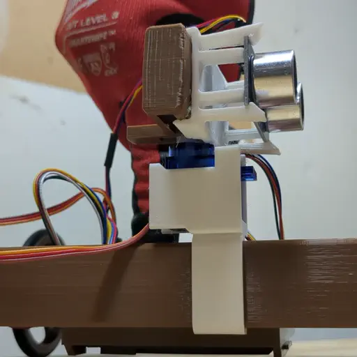

# XRP Robot Scripts

This repo contains scripts for the XRP Robot https://experientialrobotics.org

## Nerf Crossbow

Aim and fire Nerf darts using this 3D printable crossbow for the XRP robot.

Get the [Nerf Crossbow files and instructions here](https://www.printables.com/model/927561) and 3D print your own!
Download [source code for it here](nerf_crossbow/).

## Rotating Rail

Want more sensor data, but don't want to pay for an expensive sensor?
This rotating rail for the XRP is just what you need!
Attach a range sensor and sweep it in a circle to give the XRP robot a better view of its surroundings.

Get the [Rotating XRP rail files and instructions here](https://www.printables.com/model/930413) and 3D pring your own!
Download [source code for it here](rotating_rail/).